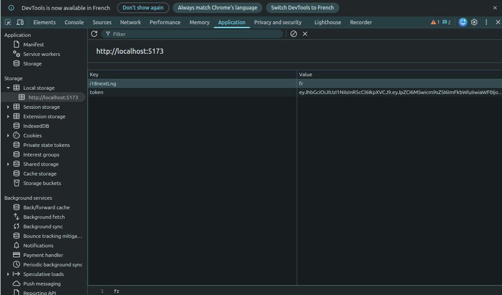
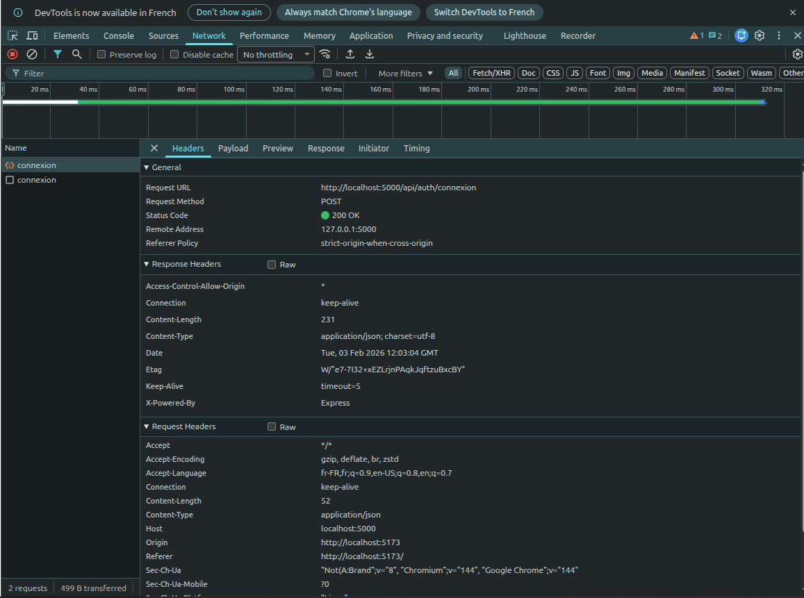
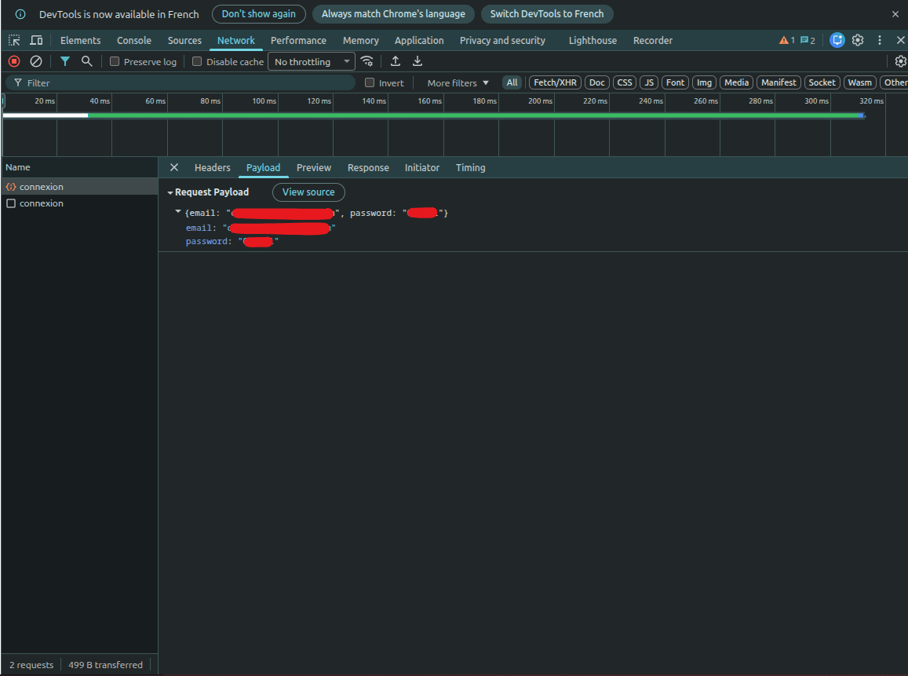

# 🔐 Documentation Complète : Authentification CDorchies

Ce document récapitule toute l'architecture mise en place pour le système d'authentification (React, Express, MySQL).

---

## 🏗️ 1. Architecture Globale

Le système utilise un flux **JWT (JSON Web Token)** :

1. **Front** : Envoie l'email et le mot de passe.
2. **Back** : Vérifie l'utilisateur et compare le mot de passe via **Bcrypt**.
3. **Back** : Génère un **Token** signé (badge d'accès).
4. **Front** : Stocke le token dans le `localStorage` et l'envoie dans chaque requête protégée.

---

## 🛠️ 2. Configuration & Installation

### Dépendances Backend

Exécute cette commande dans ton dossier `server` :

````bash
npm install jsonwebtoken bcrypt cors
npm install --save-dev @types/jsonwebtoken @types/bcrypt @types/cors```
````

Variables d'environnement (.env)

```env
NODE_ENV=development
DB_HOST=localhost
DB_USER=root
DB_PASSWORD=ton_mot_de_passe
DB_NAME=nom_bdd
JWT_SECRET=ma_cle_secrete_super_longue_123!
```

---

## 📂 3. Code Source (Backend)

### A. Le Middleware CORS (dans l'index.ts)

Indispensable pour autoriser le Front (port 5173) à parler au Back (port 5000).

```ts
import express from "express";
import cors from "cors";
import config from "./src/config/config.js";
import authRoutes from "./src/routes/authRoutes.js";

const app = express();

// Doit être placé avant les routes
app.use(cors());
app.use(express.json());
// Routes
app.use("/api/auth", authRoutes);

app.listen(config.port, "0.0.0.0", () => {
  console.log(`Serveur lancé sur : http://localhost:${config.port}`);
});
```

### B. La Route (src/routes/authRoutes.ts)

```ts
import { Router } from "express";
import { login } from "../controllers/authController.js";

const router = Router();

// La route sera : POST /api/auth/login
router.post("/connexion", login);

export default router;
```

### C. Le Controller (src/controllers/authController.ts)

```ts
import type { Request, Response } from "express";
import pool from "../config/db.js";
import bcrypt from "bcrypt";
import jwt from "jsonwebtoken";

export const login = async (req: Request, res: Response) => {
  const { email, password } = req.body;

  try {
    const [users]: any = await pool.query(
      "SELECT * FROM users WHERE email = ?",
      [email],
    );
    const user = users[0];

    // Vérification utilisateur et mot de passe haché
    if (!user || !(await bcrypt.compare(password, user.password))) {
      return res.status(401).json({ message: "Identifiants incorrects" });
    }

    const token = jwt.sign(
      { id: user.id, role: user.role },
      process.env.JWT_SECRET || "ma_cle_secrete_defaut",
      { expiresIn: "24h" },
    );

    res.json({
      token,
      user: { id: user.id, email: user.email, role: user.role },
    });
  } catch (error) {
    res.status(500).json({ message: "Erreur serveur" });
  }
};
```

### D. Le Middleware de Protection (src/middlewares/authMiddleware.ts)

A utiliser pour des routes privées (si il y en a)

```ts
import type { Request, Response, NextFunction } from "express";
import jwt from "jsonwebtoken";

export const verifyToken = (
  req: Request,
  res: Response,
  next: NextFunction,
) => {
  const token = req.headers["authorization"]?.split(" ")[1];

  if (!token) return res.status(403).json({ message: "Accès refusé" });

  try {
    const decoded = jwt.verify(
      token,
      process.env.JWT_SECRET || "ma_cle_secrete_defaut",
    );
    (req as any).user = decoded;
    next();
  } catch (err) {
    res.status(401).json({ message: "Token invalide" });
  }
};
```

---

## 💻 4. Code Source (Frontend React)

Authentification.tsx

```tsx
import { useState } from "react";

export function Authentification() {
  const [email, setEmail] = useState("");
  const [password, setPassword] = useState("");
  // Créer le .env avec l'url du localhost !
  const API_URL = import.meta.env.VITE_API_URL;

  const handleSubmit = async (e: React.FormEvent) => {
    e.preventDefault();
    const response = await fetch(`${API_URL}/auth/connexion`, {
      method: "POST",
      headers: { "Content-Type": "application/json" },
      body: JSON.stringify({ email, password }),
    });

    const data = await response.json();
    if (response.ok) {
      localStorage.setItem("token", data.token); // Stockage du badge
      alert("Connecté !");
    } else {
      alert(data.message);
    }
  };

  return (
    <form onSubmit={handleSubmit}>
      <input
        type="email"
        onChange={(e) => setEmail(e.target.value)}
        placeholder="Email"
      />
      <input
        type="password"
        onChange={(e) => setPassword(e.target.value)}
        placeholder="Password"
      />
      <button type="submit">Connexion</button>
    </form>
  );
}
```

---

## 💾 5. Gestion de la Base de Données (MySQL)

Important : On ne stocke jamais de mot de passe en clair. Pour tester l'utilisateur admin@test.fr avec le mot de passe mdp :

```sql
UPDATE users
SET password = '$2b$10$EPjFEhz7Z2.6898Fv5E6mOAt23.OpoqE0U0g.At6XmH9Y.H.C.fS.'
WHERE email = 'admin@test.fr';
```

---

## 🔍 6. Debug : Inspecter le Token dans le navigateur

Pour vérifier que le token est bien présent et enregistré :

1.  Appuie sur **F12** (ou clic droit > Inspecter) sur ton navigateur.
2.  Va dans l'onglet **Application** (en haut).
3.  Dans le menu de gauche, déroule **Storage** puis **Local Storage**.
4.  Clique sur l'URL de ton site (ex: `http://localhost:5173`).
5.  Tu dois voir apparaître une ligne avec la clé `token` et sa valeur (le JWT).
<center>
  
  
  
</center>

---

## 📋 7. Résumé des Erreurs

| Code           | Signification          | Solution                                                                                      |
| :------------- | :--------------------- | :-------------------------------------------------------------------------------------------- |
| **401**        | **Unauthorized**       | Identifiants incorrects ou mot de passe stocké en "clair" (non-haché) dans la BDD.            |
| **403**        | **Forbidden**          | Le token est manquant dans les headers ou a expiré.                                           |
| **CORS Error** | **Blocage Navigateur** | Vérifie que `app.use(cors())` est bien présent et placé **avant** tes routes dans `index.ts`. |
