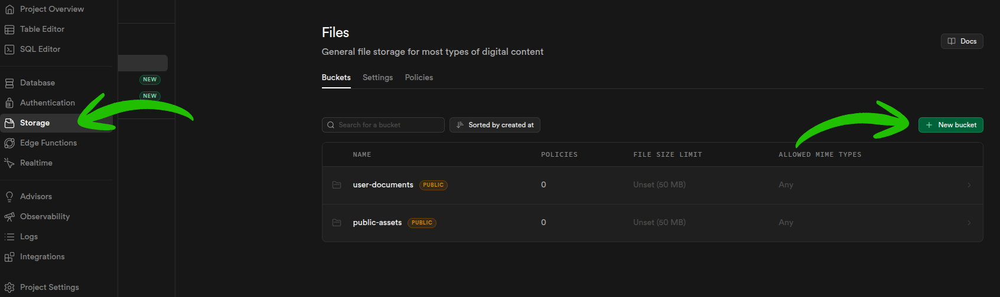
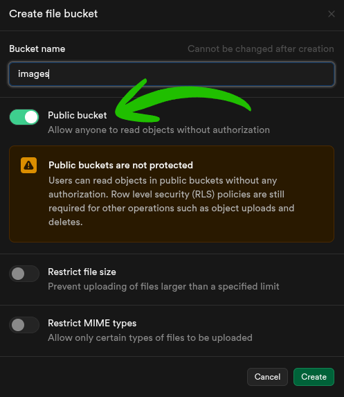
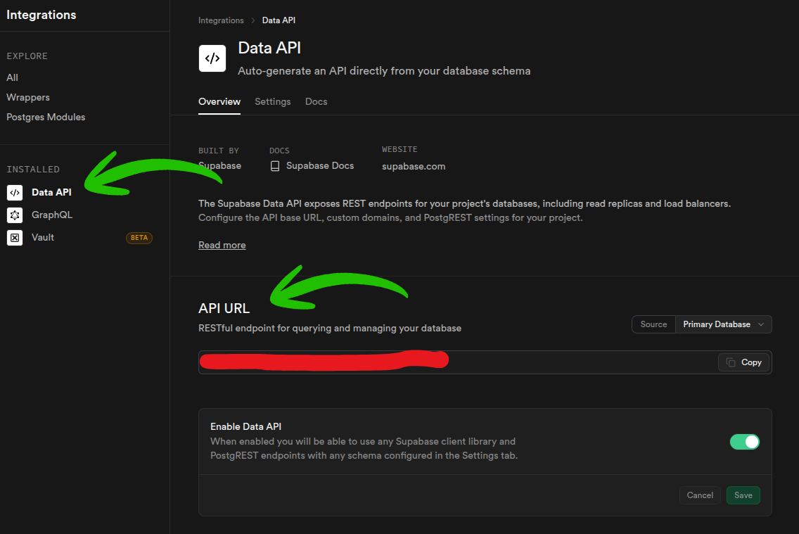
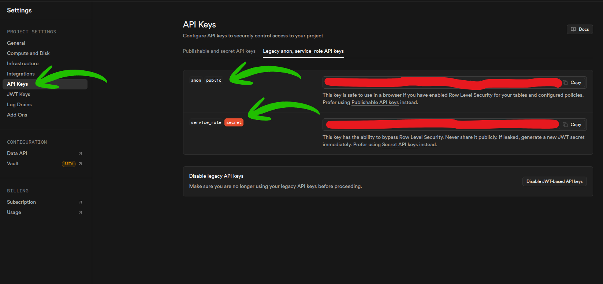
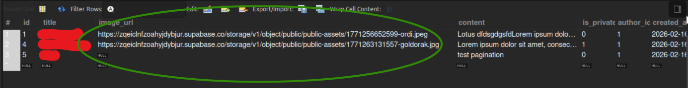

# 📚 DOCUMENTATION : SUPABASE STORAGE + EXPRESS + REACT (TS) 🚀

# ⚡ Pourquoi utiliser Supabase pour votre projet ?

## 🚀 Introduction

**Supabase** est une plateforme "Backend-as-a-Service" (BaaS) open-source. Elle est souvent décrite comme l'alternative numéro 1 à Firebase, mais avec la puissance de **PostgreSQL**. Dans notre architecture (React, Express, MySQL), Supabase intervient spécifiquement pour la gestion du **Stockage (Storage)**.

---

## 💎 Pourquoi c'est un "Must-Have" ?

### 🪶 1. Allègement du Backend

Sans Supabase, vous devriez stocker les images directement sur votre serveur Express. Cela pose deux gros problèmes :

- **Espace disque :** Votre serveur va vite saturer.
- **Performance :** Servir des images lourdes ralentit votre API.
  Supabase déporte cette charge sur ses propres serveurs optimisés, laissant votre backend Express léger et rapide.

### 🌍 2. CDN & Disponibilité

Chaque image envoyée sur Supabase est automatiquement servie via un **CDN (Content Delivery Network)**. Cela signifie que l'image est chargée depuis le serveur le plus proche de l'utilisateur, garantissant une vitesse de lecture instantanée.

### 🛡️ 3. Sécurité native

Grâce aux **Policies (RLS)**, vous pouvez définir précisément qui a le droit d'uploader ou de supprimer une image sans avoir à coder des vérifications complexes dans votre contrôleur.

### 🛠️ 4. Évolutivité (Scalability)

Que vous ayez 10 ou 10 000 images, Supabase gère la montée en charge. Vous n'avez jamais à vous soucier de la configuration matérielle de votre stockage.

### 📄 5. Gestion Multi-formats (PDF, Docs, etc.)

Supabase ne se limite pas qu'aux photos. Il est parfait pour stocker des **fichiers PDF** (factures, CV, e-books).

- **Mime-types :** Le backend détecte automatiquement que c'est un `application/pdf`.
- **Lecture directe :** L'URL générée permet à l'utilisateur d'ouvrir le PDF directement dans son navigateur sans forcer le téléchargement, ce qui améliore l'expérience utilisateur.

---

> **En résumé :** Supabase nous permet de garder une base de données MySQL propre (qui ne stocke que des URLs/textes) tout en offrant une gestion professionnelle et sécurisée des fichiers multimédias.

---

## 🛠️ 1. CONFIGURATION SUPABASE

1. Connecte-toi sur ton dashboard Supabase.
2. Va dans l'onglet Storage.
3. Crée un nouveau Bucket (ex: images).
<center>
  
</center>
4. Important : Rends le bucket "Public" pour que les images soient accessibles via URL.
<center>
  
</center>

---

## 🔐 2. LE FICHIER `.ENV` (BACKEND)

À placer à la racine de ton projet backend.

```env
PORT=5000
SUPABASE_URL=https://votre_projet.supabase.co
SUPABASE_KEY=votre_cle_service_role_ou_anon
SUPABASE_BUCKET=images
DATABASE_URL=votre_db_url
```

<center>
  
  
</center>

---

## 🚀 3. Configuration Backend (Express + TypeScript)

```bash
npm install @supabase/supabase-js multer
npm install --save-dev @types/multer
```

---

## ⚙️ 4. BACKEND : CONFIGURATION CLIENT (`src/config/supabase.ts`)

```typescript
import { createClient } from "@supabase/supabase-js";
import dotenv from "dotenv";

dotenv.config();

const supabaseUrl = process.env.SUPABASE_URL as string;
const supabaseKey = process.env.SUPABASE_KEY as string;

export const supabase = createClient(supabaseUrl, supabaseKey);
export const bucketName = process.env.SUPABASE_BUCKET as string;
```

---

## 📤 5. BACKEND : MIDDLEWARE MULTER (`src/middlewares/multer.ts`)

```typescript
import multer from "multer";

const storage = multer.memoryStorage();
export const upload = multer({ storage });
```

---

## 🧠 6. BACKEND : LE CONTROLEUR (`src/controllers/postController.ts`)

```typescript
import { Request, Response } from "express";
import { supabase, bucketName } from "../config/supabase";

export const createPost = async (req: Request, res: Response) => {
  try {
    const { title, content } = req.body;
    const file = req.file; // Récupéré par Multer

    let imageUrl = "";

    if (file) {
      // Créer un nom de fichier unique
      const fileName = `${Date.now()}-${file.originalname}`;

      // 1. Upload vers Supabase
      const { data, error } = await supabase.storage
        .from(bucketName)
        .upload(fileName, file.buffer, {
          contentType: file.mimetype,
          upsert: false,
        });

      if (error) throw error;

      // 2. Récupérer l'URL publique
      const { data: publicUrlData } = supabase.storage
        .from(bucketName)
        .getPublicUrl(fileName);

      imageUrl = publicUrlData.publicUrl;
    }

    // 3. Sauvegarder en BDD (Exemple SQL)
    // const [result] = await pool.query("INSERT INTO posts (title, content, image_url) VALUES (?, ?, ?)", [title, content, imageUrl]);

    res.status(201).json({ message: "Article créé !", imageUrl });
  } catch (error) {
    res.status(500).json({ message: "Erreur lors de l'upload" });
  }
};
```

---

## 🛣️ 7. BACKEND : ROUTES ET INDEX (`src/routes/postRoutes.ts` & `src/index.ts`)

```typescript
// postRoutes.ts
import { Router } from "express";
import { createPost } from "../controllers/postController";
import { upload } from "../middlewares/multer";

const router = Router();
router.post("/", upload.single("image"), createPost); // "image" doit correspondre au nom dans le FormData
export default router;

// index.ts
import express from "express";
import postRoutes from "./routes/postRoutes";

const app = express();
app.use(express.json());
app.use("/api/posts", postRoutes);

app.listen(5000, () => console.log("Serveur sur port 5000"));
```

---

## 🌐 8. FRONTEND : APPEL API (`src/services/blogAPI.ts`)

```typescript
const API_URL = import.meta.env.VITE_API_URL;

export const createPost = async (token: string | null, formData: FormData) => {
  const response = await fetch(`${API_URL}/posts`, {
    method: "POST",
    headers: {
      Authorization: `Bearer ${token}`,
      // Attention: Ne PAS mettre Content-Type ici, le navigateur le fait seul pour FormData
    },
    body: formData,
  });
  return response.json();
};
```

---

## 🌐 9. FRONTEND : COMPOSANT FORMULAIRE (`src/services/PostForm.tsx`)

```typescript
import { useState } from "react";

export const PostForm = () => {
  const [file, setFile] = useState<File | null>(null);

  const handleSubmit = async (e: React.FormEvent) => {
    e.preventDefault();
    const formData = new FormData();
    formData.append("title", "Mon Titre");
    if (file) formData.append("image", file); // Correspond à upload.single("image")

    await createPost(token, formData);
  };

  return (
    <form onSubmit={handleSubmit}>
      <input type="file" onChange={(e) => setFile(e.target.files?.[0] || null)} />
      <button type="submit">Envoyer</button>
    </form>
  );
};
```

<center>
  
</center>

---

## 🐞 10. BUGS COURANTS & RÉPARATIONS

| Bug 🐞             | Cause                    | Réparation ✅                                                                                                                                                   |
| :----------------- | :----------------------- | :-------------------------------------------------------------------------------------------------------------------------------------------------------------- |
| **403 Forbidden**  | RLS (Row Level Security) | Sur Supabase, ajoute une Policy INSERT/SELECT sur le bucket.                                                                                                    |
| **Empty File**     | Nom du champ             | `formData.append("image", file)` doit matcher `upload.single("image")`.                                                                                         |
| **URL incorrecte** | Bucket privé             | Coche la case "Public" dans les réglages du Bucket.                                                                                                             |
| **Erreur 500 JWS** | Extraction du Token      | Vérifie ton middleware : il faut souvent faire `const token = req.headers.authorization?.split(" ")[1];` pour ignorer le mot "Bearer" et ne garder que le hash. |
| **JWT Malformed**  | Token vide ou null       | Côté Frontend, assure-toi de ne pas envoyer la chaîne `"Bearer null"` ou `"Bearer undefined"` si l'utilisateur n'est pas connecté.                              |

---

## 💡 11. Pro Tips

- Nettoyage : Si tu supprimes une image en BDD, n'oublie pas de supprimer aussi le fichier sur Supabase avec `await supabase.storage.from(bucketName).remove(["nom_du_fichier.png"]);`.
